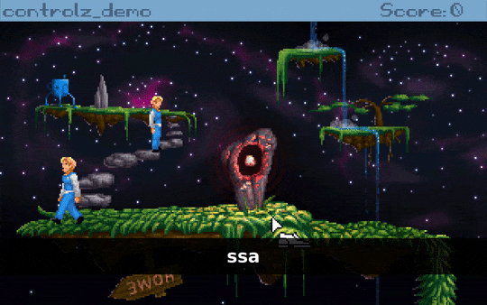

# controlz
Move your character with keyboard or joystick controlz for Adventure Game Studio.



This code was originally made by Dualnames for Strangeland and I eri0o got his 
permission to open source and wrapped in this function to be easier for 
consumption.

## usage

```AGS Script
// called on every game cycle, except when the game is blocked
function repeatedly_execute() 
{
  Controlz(player, 
    IsKeyPressed(eKeyDownArrow),
    IsKeyPressed(eKeyLeftArrow), 
    IsKeyPressed(eKeyRightArrow),
    IsKeyPressed(eKeyUpArrow));

  Controlz(cEgo2, 
    IsKeyPressed(eKeyS),  IsKeyPressed(eKeyA), 
    IsKeyPressed(eKeyD),  IsKeyPressed(eKeyW));
}
```

## script API

Controlz only has a single function

`Controlz(Character* c, bool down,  bool left,  bool right,  bool up)`

Call it on your repeatedly execute or repeatedly execute always, 
passing a character and which keys are pressed at that time.

## License

This code is licensed with MIT [`LICENSE`](LICENSE).
